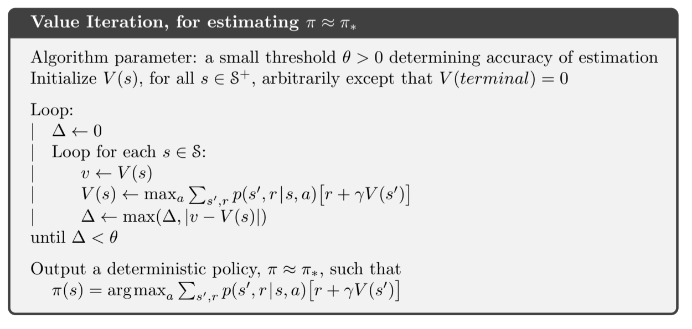

# Value Iteration

## Introduction to Value Iteration

Value Iteration is a core algorithm in reinforcement learning, designed to find the optimal policy π in environments modeled as Markov Decision Processes (MDPs). It differentiates from other strategies like Policy Iteration by focusing on perfecting the value function V(s), which quantifies the expected long-term return from each state s.

Picture a robot in a labyrinth, tasked with finding the most efficient route to a charging station. Each decision it makes can lead to different outcomes—a dead-end, a step closer to the goal, or reaching the goal itself. Value Iteration arms the robot with the ability to foresee and evaluate the potential future payoff of each action, thereby guiding it to choose the path that optimizes its chances of reaching the charger in the most effective way.

### Gridworld Example

In Gridworld, the agent needs to find the optimal path to a charging station, navigating a grid that contains rewards and pitfalls. Value Iteration methodically updates the expected utility of each grid cell, enabling the robot to eventually discern the most rewarding path to its destination.

## Markov Decision Processes (MDPs) Explained

MDPs are frameworks for decision-making where outcomes are partially random and partially under your control. They consist of:

- **States (S):** These are like the rooms in our game. Each state represents a scenario you might find yourself in.
- **Actions (A):** These are the choices you can make in each state, like choosing a door in a room.
- **Transition Probabilities (P(s'|s,a)):** This tells you the likelihood of ending up in a new state (s') if you take an action (a) in your current state (s).
- **Reward Functions (R(s,a,s')):** This is the reward or penalty you get after moving to a new state.
- **Discount Factor (γ):** This decides how much you value immediate rewards compared to future rewards.

Your goal is to create a policy, a set of rules that tells you the best action to take in each state to collect the most rewards over time.

## Mathematical Framework of Value Iteration

### Starting Point:
- We begin by guessing the rewards (value function) for all scenarios, except we know the end scenarios (like reaching the charging station) have certain values (like a big reward for success).

### Loop of Improvements:
- We then repeatedly update our guesses of the rewards for each scenario. In each round, we consider the rewards we know and the best choices available, to refine our guesses.
- We keep doing this until our guesses don't change much anymore, meaning we've found a stable set of rewards.

### Final Strategy (Policy):
- Once we have stable rewards for each scenario, we can easily decide the best action in each scenario to maximize rewards. This set of best actions is our final strategy.

### Step-by-Step Explanation

1. **Initialization:**
   - Initialize the value function V(s) for all states s arbitrarily, setting the values of terminal states to 0.

2. **Iteration Loop:**
   - Set Δ to 0 to monitor the largest change in the value function.
   - Update the value of each state s by calculating the maximum expected utility for any action a taken from s:
       `V(s) = max_a Σ P(s'|s,a) [ R(s,a,s') + γV(s') ]`
   - Continue this process until Δ, the maximum alteration in the value function for any state, is less than a small threshold θ, indicating stability in the value function.

3. **Policy Extraction:**
   - After convergence of V(s), derive the optimal policy π by selecting for each state s the action a that produces the highest value:
     `π(s) = argmax_a Σ P(s'|s,a) [ R(s,a,s') + γV(s') ]`

### Convergence and Optimality

The iterative process of Value Iteration ensures convergence to the optimal value function V* and policy π*, thanks to the Bellman Optimality Equation. The algorithm is guaranteed to find the optimal policy in a finite number of steps for MDPs with finite states and actions.

### Algorithm Parameter

- **θ (theta):** A small threshold used to determine the accuracy of estimation, influencing the precision of the final value function and policy.

## Significance in Reinforcement Learning

Value Iteration is a foundational algorithm in reinforcement learning for creating effective strategies in uncertain and complex environments. Its direct focus on the value function streamlines the process of policy determination, often making it simpler and computationally more efficient than Policy Iteration.

## Difference Between Policy Iteration and Value Iteration

While both Policy Iteration and Value Iteration are used to find the optimal policy in MDPs, they differ in methodology:

- **Policy Evaluation vs. Direct Maximization:**
  Policy Iteration involves a separate policy evaluation step, where the value of following the current policy is computed until it converges. In Value Iteration, policy evaluation and improvement are combined into a single step that directly computes the maximum value across actions.

- **Policy Convergence:**
  Policy Iteration alternates between improving the policy and evaluating it until the policy converges. Value Iteration, on the other hand, focuses on the convergence of the value function, and the optimal policy is derived from the optimal value function.

- **Computational Efficiency:**
  Policy Iteration may require fewer iterations to converge since it directly manipulates the policy. However, each iteration involves solving a system of equations, which can be computationally expensive. Value Iteration simplifies each iteration but may require more iterations to converge. However, each iteration is typically cheaper to compute.

- **Practical Application:**
  In practice, Value Iteration is often simpler to implement because it does not require maintaining a separate policy array or solving a potentially large system of equations during the policy evaluation step.

## Conclusion

Value Iteration is an effective algorithm for optimizing decisions in MDPs. It provides a clear and methodical way to compute the optimal policy by refining state values through an iterative process. Mastery of Value Iteration, alongside an understanding of Policy Iteration, is crucial for those looking to advance in the field of reinforcement learning.

## Pseudo Code

